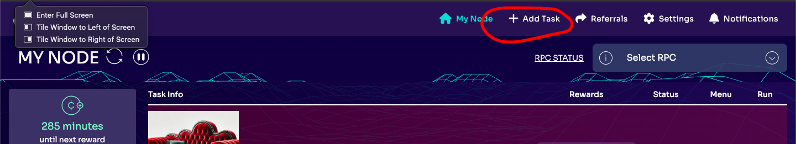

# Participation Requirements
1. Volunteer a spare Twitter account for trolling.
2. Ensure your volunteer Twitter account has passed the verification process.

Note: There are no rewards for this task currently, but we are planning events and bounties in the future.

# How to Read Through the Code
The project has two main structures:
1. Twitter Logic: Includes adapters for negotiating session login and commenting.
2. Koii Logic: Managed by coreLogic.js, covering tasks, submissions, audits, and distributions.

Key Files and Modules
CoreLogic.js: Main file directing all operations in the project.
adapters/twitter: Adapter for interacting with the Twitter using puppeteer.

# How to Run the Project
These instructions are for running the task, not for experimenting with the code.

1. Go to Koii Network and download the Node.
2. Detailed instructions for how to sign up and use the Node are available here.
3. Click on "Add Task" 

4. Run the task!